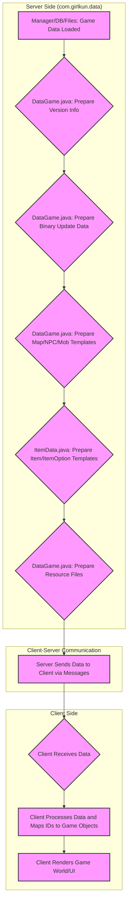

## Overview of `com.girlkun.data` package

**Purpose:**
The `com.girlkun.data` package is responsible for managing and transmitting various game-related data and resources from the server to the client. It acts as a data layer, ensuring that clients receive up-to-date information about game elements like items, maps, skills, and other assets.

**Key Classes and Their Roles:**
*   **`DataGame.java`**: This is a central class for handling the versioning and transmission of a wide array of game assets. It sends data related to maps, skills, mobs, NPCs, effects, icons, and general game resources. It also contains utility `main` methods (likely for development) to process map data.
    *   **Key Data Transmitted:**
        *   Version information (`vsData`, `vsMap`, `vsSkill`, `vsItem`, `vsRes`).
        *   Server IP/Port (`LINK_IP_PORT`).
        *   Mount number mappings (`MAP_MOUNT_NUM`).
        *   Binary data for updates (`dart`, `arrow`, `effect`, `image`, `part`, `skill`).
        *   Map templates (names).
        *   NPC templates (name, head, body, leg).
        *   Mob templates (type, name, hp, range, speed, dart type).
        *   Skill data (class, name, max point, mana use type, icon, damage info, individual skill details like cooldown, power require).
        *   Image version data.
        *   Effect templates (data and images).
        *   Item background templates.
        *   Icon data.
        *   Mob templates.
        *   Tile set info.
        *   Map tile data.
        *   Head avatar data.
        *   Images by name.
        *   Resource files.
*   **`ItemData.java`**: This class specializes in item-related data. It defines lists of specific item IDs (e.g., food, crafting items) and provides methods to send item templates and item option templates to the client. It uses a chunked approach for efficient data transfer.
    *   **Key Data Transmitted:**
        *   Lists of specific item IDs (`list_thuc_an`, `list_dapdo`, `phieu`).
        *   Item option templates (id, name, type).
        *   Item templates (type, gender, name, description, level, strength requirement, icon ID, part, isUpToUp).

**Overall Significance:** The `data` package plays a crucial role in the client-server communication of the game. it ensures that the client's game state and visual representation are synchronized with the server's data. The classes within this package interact heavily with `Manager` classes (e.g., `Manager.ITEM_TEMPLATES`, `Manager.MAP_TEMPLATES`) which suggests that the actual game data is loaded and held in memory by these `Manager` classes, and the `data` package is responsible for packaging and sending that information to connected clients. The presence of versioning bytes (`vsData`, `vsItem`, etc.) indicates a mechanism for clients to check if they need to request updated data.

### Information about mapping tables / How data is mapped:

The `com.girlkun.data` package is less about defining "mapping tables" in the database sense and more about *transmitting* data that has already been mapped or structured elsewhere (e.g., in `Manager` classes or loaded from external files). However, it does contain examples of how data is structured for transmission, which implies an underlying mapping.

*   **Implicit Mapping through IDs:** The various `update*` methods in `DataGame.java` and `ItemData.java` send data that is identified by IDs. For example, `updateMap` sends `MapTemplate` objects, which have an `id`. The client would then use this `id` to map the received data to its internal representation of maps. Similarly for `NpcTemplate`, `MobTemplate`, `SkillTemplate`, `ItemTemplate`, and `ItemOptionTemplate`.
*   **`MAP_MOUNT_NUM` in `DataGame.java`:** This is an explicit in-memory mapping table. It maps string keys (item IDs as strings) to short integers (mount IDs + 30000). This is a direct example of a mapping table within the `data` package itself, used to translate item IDs into mount IDs for client display.
*   **File-based Mapping:** Many methods in `DataGame.java` read data from specific file paths (e.g., `data/girlkun/update_data/dart`, `data/girlkun/map/tile_set_info`). The file names or their internal structure implicitly map to specific types of game data. For instance, `data/girlkun/icon/x<zoomLevel>/<id>.png` maps an icon ID to its image file.

### Sơ đồ luồng (Flow Diagram):

