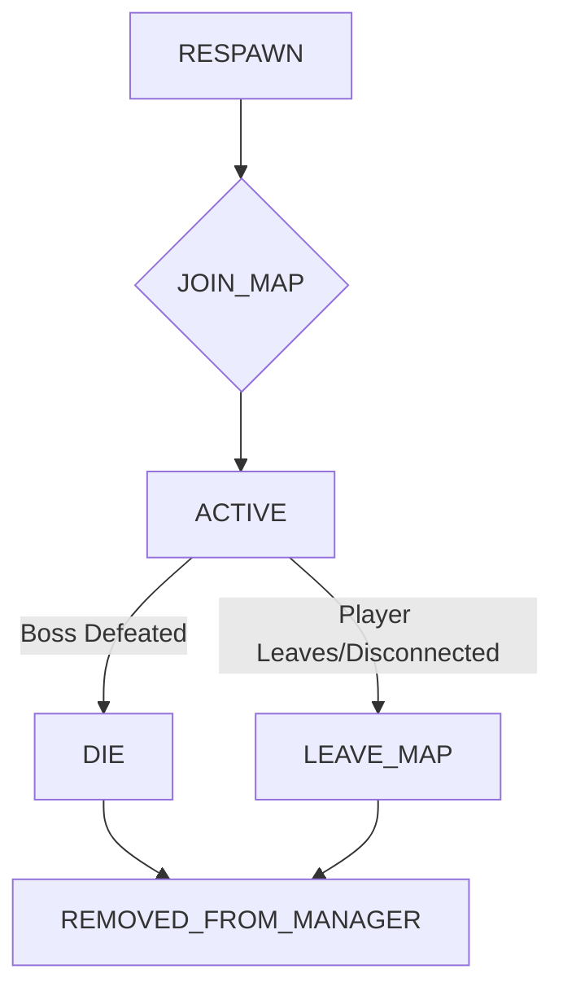

# Project Overview

This project is a Java-based game server for a Dragon Ball-themed MMORPG called "NRO Tabi". The server manages game data, player interactions, and the game world. It uses a MySQL database to store persistent data and loads additional game assets from local files.

### Key Technologies

*   **Language:** Java
*   **Build Tool:** Ant
*   **Database:** MySQL
*   **Networking:** Custom TCP server

## Building and Running

### Building the Project

The project is built using Apache Ant. The `build.xml` file defines the build process. To build the project, you can run the following command in the project's root directory:

```bash
ant
```

This will compile the source code and create a distributable JAR file in the `dist` directory.

### Running the Server

The server can be started by running the `run.bat` script, which executes the main JAR file:

```bash
./run.bat
```

Alternatively, you can run the server directly from the command line:

```bash
java -jar dist/Arriety.jar
```

The server's main class is `com.girlkun.server.ServerManager`.

## Development Conventions

### Code Style

The code follows standard Java conventions.

### Configuration

The server is configured through the `data/girlkun/girlkun.properties` file. This file contains settings for the server port, database connection, and other game-related parameters.

### Data Management

Game data is stored in a MySQL database. The `solomon.sql` file contains the database schema. Additional game data, such as maps, items, and NPC information, is loaded from files in the `data/girlkun` directory.

## Database Access Layer (com.girlkun.jdbc.daos)

The `com.girlkun.jdbc.daos` package contains Data Access Objects (DAOs) responsible for interacting with the MySQL database to manage various game entities. These DAOs abstract the database operations, providing methods for creating, reading, updating, and deleting (CRUD) data related to players, gifts, transaction history, and in-game shops.

### Key Database Tables and Their Relationships:

*   **`account`**: Stores user account information, including login credentials, administrative status, last login/logout times, and in-game currency (`thoi_vang`, `vnd`).
*   **`player`**: Stores detailed player-specific data, including character attributes (name, gender, head), inventory (gold, gem, ruby, coupon, event), location, stats (power, stamina, HP, MP), skills, items (body, bag, box), friends, enemies, intrinsic abilities, item durations, daily tasks, Mabu egg status, Time Dua status, Tai Xiu game data, charms, pet information, black ball rewards, achievement data, and summon beast data. Many complex data types are stored as JSON arrays within single columns (e.g., `data_inventory`, `data_point`, `items_body`, `skills`).
*   **`gift`**: Stores information about gifts given to players, linked to `player` via `player_id`.
*   **`history_transaction`**: Logs player-to-player transactions, including gold and item exchanges, and inventory states before and after the transaction.
*   **`history_gold`**: Records historical gold transactions for players.
*   **`history_receive_goldbar`**: Logs instances where players receive gold bars, detailing gold amounts before and after.
*   **`naptien`**: Records top-up transactions, including user ID, amount, serial, code, card type, time, content, status, transaction ID, and referral code.
*   **`shop`**: Defines in-game shops, including their ID, associated NPC, tag name, and type.
*   **`tab_shop`**: Represents tabs within a shop, linked to `shop` via `shop_id`. Each tab has an ID and a name.
*   **`item_shop`**: Lists items available for sale within a shop tab, linked to `tab_shop` via `tab_id`. Includes item template ID, new status, cost, icon, and sell type.
*   **`item_shop_option`**: Stores options (e.g., stats, enchantments) for items sold in shops, linked to `item_shop` via `item_shop_id`.

### Data Flow and Mapping Overview:

The DAOs primarily facilitate the loading and saving of game state to and from the MySQL database.

1.  **Player Login/Loading:**
    *   The `GodGK` DAO handles player authentication by querying the `account` table.
    *   Upon successful login, `GodGK` and `PlayerDAO` work together to load comprehensive player data from the `player` table. This involves extensive parsing of JSON strings stored in various columns to reconstruct complex Java objects (e.g., `Player` object, `Inventory`, `NPoint`, `MagicTree`, `Skill` lists, `Item` lists for body, bag, and box).
    *   `GiftDAO` loads gift-related data for the player.

2.  **Player Data Persistence:**
    *   `PlayerDAO` is responsible for saving player data back to the `player` table. This involves serializing Java objects back into JSON strings for storage in the database.
    *   Updates to `account` information (e.g., gold bars, VND) are handled by `PlayerDAO` and `GodGK`.

3.  **Transaction Logging:**
    *   `HistoryTransactionDAO` records details of player-to-player item and gold exchanges.
    *   `PlayerDAO` logs gold-related transactions in `history_gold` and `history_receive_goldbar`.
    *   `PlayerDAO` also logs top-up transactions in `naptien`.

4.  **Shop Data Management:**
    *   `ShopDAO` loads the hierarchical structure of in-game shops, including their tabs, items, and item options, by querying `shop`, `tab_shop`, `item_shop`, and `item_shop_option` tables. This data is typically loaded once at server startup or when needed to populate the in-game shop interfaces.

### Conceptual Data Flow Diagram:

```
+-------------------+       +-------------------+       +-------------------+
|     Client/Game   |       |     Server Logic  |       |    MySQL Database |
|     Application   |       | (com.girlkun.*)   |       |                   |
+-------------------+       +-------------------+       +-------------------+
        |                           |                           |
        | (Login Request)           |                           |
        +-------------------------->| GodGK.login()             |
        |                           |                           |
        |                           | Query account table       |
        |                           +-------------------------->| account           |
        |                           |                           |                   |
        |                           | Query player table        |
        |                           +-------------------------->| player            |
        |                           |                           |                   |
        |                           | Parse JSON data           |
        |                           | Construct Player Object   |
        |                           |                           |
        |                           | GiftDAO.loadGiftPlayer()  |
        |                           +-------------------------->| gift              |
        |                           |                           |                   |
        | (Player Data Loaded)      |                           |
        |<--------------------------+                           |
        |                           |                           |
        | (Game Actions: Trade,     |                           |
        |  Inventory Changes, etc.) |                           |
        +-------------------------->| PlayerDAO.updatePlayer()  |
        |                           |                           |
        |                           | Serialize Player Object   |
        |                           | Update player table       |
        |                           +-------------------------->| player            |
        |                           |                           |                   |
        |                           | HistoryTransactionDAO.insert() |
        |                           +-------------------------->| history_transaction|
        |                           |                           |                   |
        |                           | PlayerDAO.subGoldBar()    |
        |                           +-------------------------->| account           |
        |                           |                           | history_gold      |
        |                           |                           |                   |
        | (Shop Access)             |                           |
        +-------------------------->| ShopDAO.getShops()        |
        |                           |                           |
        |                           | Query shop, tab_shop,     |
        |                           | item_shop, item_shop_option|
        |                           +-------------------------->| shop              |
        |                           |                           | tab_shop          |
        |                           |                           | item_shop         |
        |                           |                           | item_shop_option  |
        |                           |                           |                   |
        | (Shop Data Displayed)     |                           |
        |<--------------------------+                           |
        |                           |                           |
```

## Martial Arts Tournament (DHVT) Bosses (com.girlkun.models.boss.dhvt)

This package defines the bosses encountered in the "Đại Hội Võ Thuật" (Martial Arts Tournament) feature.

### DHVT Boss Class Mapping:

| Boss Class        | Boss ID (from BossID) | Associated Data (from BossesData) | Description                                     |
| :---------------- | :-------------------- | :-------------------------------- | :---------------------------------------------- |
| `BossDHVT`        | N/A (Abstract)        | N/A                               | Base class for all DHVT bosses, defines core behavior. |
| `ChanXu`          | `BossID.CHAN_XU`      | `BossesData.CHAN_XU`              | A specific DHVT boss.                           |
| `ChaPa`           | `BossID.CHA_PA`       | `BossesData.CHA_PA`               | A specific DHVT boss.                           |
| `JackyChun`       | `BossID.JACKY_CHUN`   | `BossesData.JACKY_CHUN`           | A specific DHVT boss.                           |
| `LiuLiu`          | `BossID.LIU_LIU`      | `BossesData.LIU_LIU`              | A specific DHVT boss.                           |
| `ODo`             | `BossID.O_DO`         | `BossesData.O_DO`                 | A specific DHVT boss.                           |
| `PonPut`          | `BossID.PON_PUT`      | `BossesData.PON_PUT`              | A specific DHVT boss.                           |
| `SoiHecQuyn`      | `BossID.SOI_HEC_QUYN`  | `BossesData.SOI_HEC_QUYN`         | A specific DHVT boss.                           |
| `TauPayPay`       | `BossID.TAU_PAY_PAY`  | `BossesData.TAU_PAY_PAY`          | A specific DHVT boss.                           |
| `ThienXinHang`    | `BossID.THIEN_XIN_HANG`| `BossesData.THIEN_XIN_HANG`       | A specific DHVT boss.                           |
| `ThienXinHangClone`| `BossID.THIEN_XIN_HANG_CLONE`| `BossesData.THIEN_XIN_HANG_CLONE`| A specific DHVT boss (clone).                   |
| `Xinbato`         | `BossID.XINBATO`      | `BossesData.XINBATO`              | A specific DHVT boss.                           |
| `Yamcha`          | `BossID.YAMCHA`       | `BossesData.YAMCHA`               | A specific DHVT boss.                           |

### DHVT Boss Lifecycle Flow Diagram:



**Explanation of Lifecycle:**
*   **RESPAWN:** The initial state where the boss is prepared to appear.
*   **JOIN_MAP:** The boss is placed onto the game map.
*   **ACTIVE:** The boss is actively engaging in combat, moving, and attacking.
*   **DIE:** The boss has been defeated by a player.
*   **LEAVE_MAP:** The boss leaves the map, typically if the player disconnects or leaves the boss's zone.
*   **REMOVED_FROM_MANAGER:** The boss object is removed from the game's active boss management system.